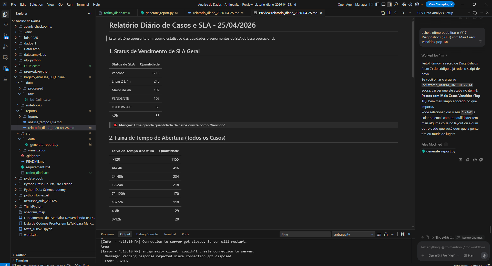
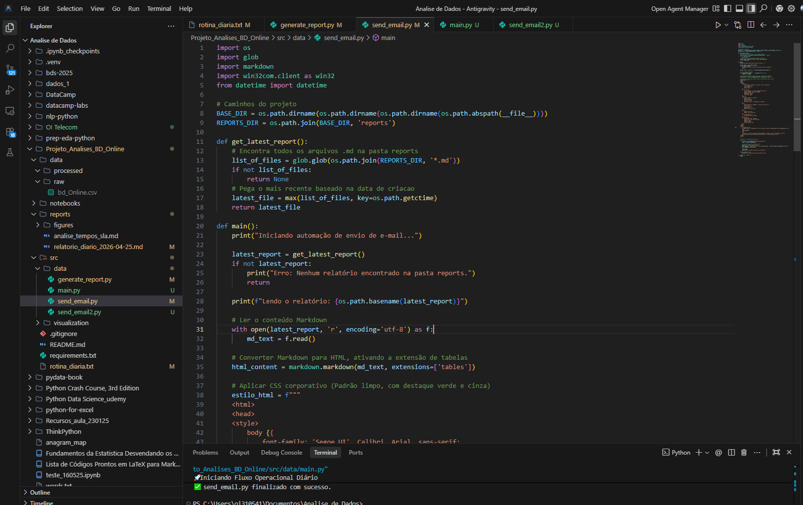
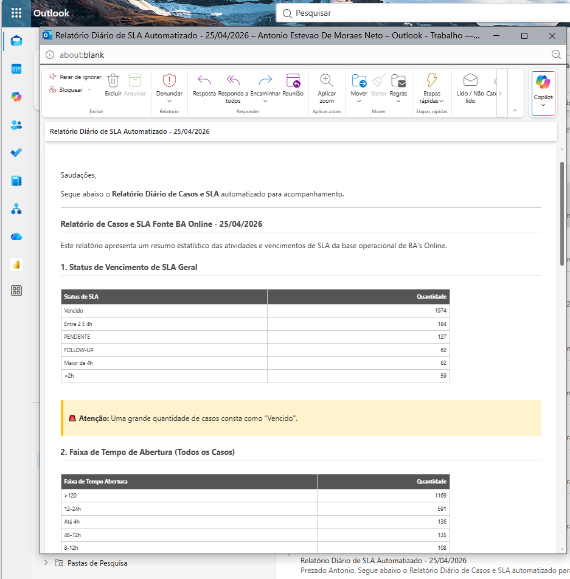

[](https://github.com/aestevaomoraes)

# 📊 Telecom Operations Analytics (AI + Automation)

## 🎯 Business Problem

In telecom operations, generating daily reports for SLA monitoring and operational performance is often manual, time-consuming, and inconsistent.

This project addresses this challenge by:

👉 Automating operational analysis using Python  
👉 Leveraging AI (Prompt Engineering) to structure insights  
👉 Automating report delivery via email  
👉 Reducing manual workload in reporting processes  

---

## 🤖 Solution Overview

This project combines:

- 📊 Data processing (Python & Pandas)  
- 🤖 AI-driven insights (Prompt Engineering - Antigravity)  
- ⚙️ Automation of reporting workflows  
- 📧 Automated email delivery (RPA - Outlook integration)  

👉 Result: a fully automated **end-to-end pipeline** from data processing to report delivery.

## 📸 Example Outputs

 📊 **Generated Report**   


 🔄 **Automation Workflow**   


 📧 **Automated Email Delivery**   


---

## 📦 Dataset

Operational dataset containing:

- Service requests  
- SLA deadlines  
- Resolution times  
- Operational backlog  

---

## 🧠 Approach

The workflow follows a modern data + AI approach:

🔹 Data ingestion and cleaning  
🔹 KPI calculation (SLA, backlog, resolution time)  
🔹 AI-assisted interpretation (prompt engineering)  
🔹 Automated report generation (Markdown output)  
🔹 Automated email delivery to stakeholders  

---

## 📊 Key Metrics

- ⏱️ SLA compliance  
- 📉 Backlog volume  
- 📈 Average resolution time  
- 🚨 Delayed requests  

---

## ⚙️ Automation Workflow

Daily process:

1. Extract latest dataset (`bd_Online.csv`)  
2. Replace file in `data/raw/`  
3. Run automated script  

```bash
python src/data/generate_report.py
